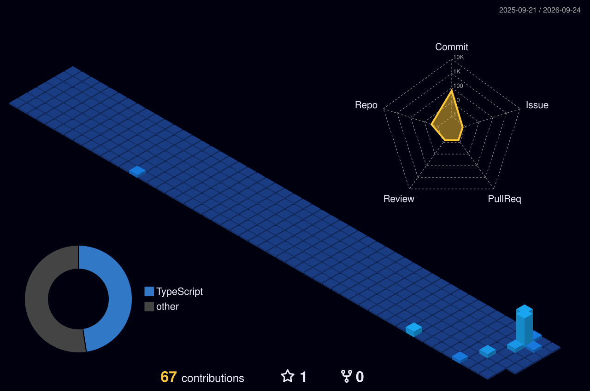

<h1>NIYA GANESH</h1>

  <b>Machine Learning Engineer</b> &nbsp;•&nbsp;
  <b>Full-Stack Developer</b>

  Building intelligent systems and turning ideas into products.

 

<!-- 3D VISUAL -->

 

<!-- TECH STACK -->

<h2>Tech Stack</h2>

  <i>Technologies I work with</i>

 

<h4>Languages</h4>

  

<h4>Frontend & Backend</h4>

  

<h4>AI / Machine Learning</h4>

  

<h4>Databases</h4>

  

<h4>Tools</h4>

 

<!-- PROJECTS -->

<h2>Projects</h2>

 

<table align="center">
<tr>

<td width="50%" valign="top">

<h3>🧠 Brain Tumor Detection</h3>

Deep-learning based system for classifying
brain MRI scans.

<b>Python · TensorFlow · Keras · CNN · Transfer Learning</b>

</td>

<td width="50%" valign="top">

<h3>🗺️ Pathfinding Visualizer</h3>

Interactive visualization of pathfinding
and search algorithms.

<b>Algorithms · Data Structures · Visualization</b>

</td>

</tr>
</table>

 

<!-- 3D CONTRIBUTION -->

<h2>3D Contributions</h2>

A 3D visualization of my GitHub activity.

 

<!-- EDUCATION -->

<h2>Education</h2>

 

<table>
<tr>

<td align="center" width="50%">

<h3>National Institute of Technology, Jalandhar</h3>

<b>B.Tech — Information Technology</b>

  

2024 — 2028

</td>

<td align="center" width="50%">

<h3>The Indian School, Bahrain</h3>

<b>Higher Secondary Education</b>

  

2024

</td>

</tr>
</table>

 

<!-- CONNECT -->

<h2>Connect</h2>

 

  

Thanks for visiting ✦

