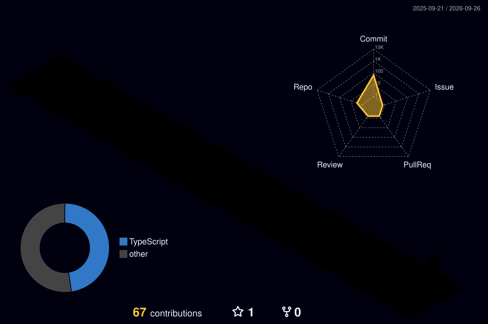

<pre>
███╗   ██╗██╗██╗   ██╗ █████╗
████╗  ██║██║╚██╗ ██╔╝██╔══██╗
██╔██╗ ██║██║ ╚████╔╝ ███████║
██║╚██╗██║██║  ╚██╔╝  ██╔══██║
██║ ╚████║██║   ██║   ██║  ██║
╚═╝  ╚═══╝╚═╝   ╚═╝   ╚═╝  ╚═╝
</pre>

<h1>NIYA GANESH</h1>

  <code>AI/ML</code>
  <code>FULL-STACK</code>
  <code>PROBLEM SOLVER</code>

  <i>Building things. Breaking things. Learning how they work.</i>

<h2>✦ PROJECTS ✦</h2>

<table>
<tr>
<td width="50%" valign="top">

<h3>🧠 Brain Tumor Detection</h3>

A deep-learning based system for classifying brain MRI scans.

<b>Stack</b> 
Python · TensorFlow · Keras · CNN · Transfer Learning

MRI preprocessing, augmentation and model evaluation using
NumPy, Pillow, Scikit-learn and Matplotlib.

</td>

<td width="50%" valign="top">

<h3>🗺️ Pathfinding Visualizer</h3>

An interactive visualization project for exploring pathfinding
and search algorithms.

<b>Focus</b> 
Algorithms · Data Structures · Visualization

Designed to make algorithmic pathfinding easier to understand
through visual exploration.

</td>
</tr>
</table>

<h2>⚡ TECH STACK ⚡</h2>

<b>Languages</b>

C · C++ · Java · Python · JavaScript · TypeScript

<b>Development</b>

React · Node.js · Express · FastAPI · HTML · CSS

<b>AI / ML</b>

TensorFlow · Keras · CNN · Transfer Learning · Scikit-learn

<b>Databases</b>

MySQL · MongoDB · PostgreSQL · Redis · SQL Server

<b>Tools</b>

Git · GitHub · Docker · Postman · VS Code · Pytest

<h2>🧊 3D CONTRIBUTION MATRIX 🧊</h2>

A 3D view of my GitHub contribution activity.

<h2>🎓 EDUCATION</h2>

<table>
<tr>
<td>

<b>B.Tech — Information Technology</b> 
National Institute of Technology, Jalandhar 
<code>2024 — 2028</code>

</td>

<td>

<b>Higher Secondary Education</b> 
The Indian School, Isa Town, Bahrain 
<code>2024</code>

</td>
</tr>
</table>

<h2>🌐 CONNECT</h2>

<pre>
╔══════════════════════════════════════════╗
║                                          ║
║       SYSTEM ONLINE • KEEP BUILDING      ║
║                                          ║
╚══════════════════════════════════════════╝
</pre>

© 2026 Niya Ganesh

